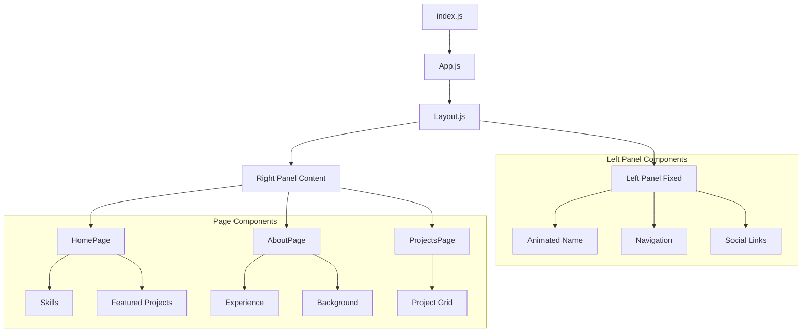

# Portfolio Project Repository Documentation

## Project Overview
This is a React-based personal portfolio website hosted on GitHub Pages. The site features a fixed left panel with navigation and a dynamic right panel that displays different content based on the selected route. The site showcases professional experience, projects, and skills with an emphasis on clean design and smooth animations.

## Directory Structure
```
portfolio-project/
├── build/                  # Compiled files for deployment
├── node_modules/          # Project dependencies
├── public/               # Static files
│   ├── index.html      # Main HTML file
│   ├── manifest.json  # PWA manifest
│   └── images/       # Public images
├── src/              # Source code
│   ├── components/  # Reusable UI components
│   │   ├── Layout/         # Layout component
│   │   │   ├── Layout.js   # Component code
│   │   │   └── Layout.module.css  # Scoped styles
│   │   └── ...
│   ├── pages/           # Main page components
│   │   ├── home/       # Home page
│   │   │   ├── home_page.js
│   │   │   └── home_styles.module.css
│   │   ├── about/     # About page
│   │   └── projects/  # Projects page
│   ├── images/       # Static image assets
│   ├── styles/      # Global styles
│   └── utils/      # Utility functions
├── .gitignore     # Git ignore rules
├── deploy.sh     # Deployment script
└── package.json # Project configuration
```

## Application Flow


## Key Components

### 1. Entry Points
- **index.js**: Application entry point
   - Renders root React component
   - Initializes global styles
   - Sets up React strict mode
- **App.js**: Main application component
   - Configures React Router
   - Establishes route structure
   - Wraps layout component

### 2. Layout System
The application uses a two-panel layout system:

#### Left Panel (Fixed)
- Personal introduction with animated name
   - Rainbow animation effect
   - Fade-in sequence
- Navigation menu
   - Route-based navigation
   - Smooth transitions
- Social media links
   - GitHub profile
   - LinkedIn profile
- Contact information
   - Toggleable email display
   - Resume download

#### Right Panel (Dynamic)
- Changes content based on selected route
- Smooth transitions between pages
- Intersection Observer animations
- Responsive design for mobile viewing

[Rest of the content remains similar but with added detail for each section...]

## Installation and Setup

### Prerequisites
- Node.js (v14 or higher)
- npm or yarn
- Git

### Local Development Setup
```bash
# Clone the repository
git clone [repository-url]

# Navigate to project directory
cd portfolio-project

# Install dependencies
npm install

# Start development server
npm start

# Run tests
npm test

# Build for production
npm run build
```

### 3. Pages

#### Home Page (`/pages/home/`)
- Personal introduction with photo
- Skills section
- Featured projects
- Organization logos

#### About Page (`/pages/about/`)
- Detailed personal background
- Professional experience
- Educational history
- Skills and certifications

#### Projects Page (`/pages/projects/`)
- Comprehensive project showcase
- Project cards with descriptions
- Links to live demos and repositories

## Styling System

### CSS Modules
- Each component has its own scoped CSS module
- Prevents style conflicts
- Makes maintenance easier

### Global Styles
- `global_styles.css`: Base styles and resets
- `variables.css`: CSS variables for consistent theming

## Key Features

### 1. Animations
- Rainbow effect on name load
- Fade-in transitions for content
- Hover effects on interactive elements

### 2. Responsive Design
- Mobile-friendly layout
- Flexible grid systems
- Adaptive navigation

### 3. Interactive Elements
- Project cards with hover effects
- Clickable links and buttons
- Social media integration

## Development Workflow

### Local Development
```bash
# Install dependencies
npm install

# Start development server
npm start

# Build for production
npm run build
```

### Deployment
```bash
# Make files executable
chmod +x deploy.sh

# Deploy to GitHub Pages
./deploy.sh
```

## Image Assets
Located in `/src/images/`:
- Personal photos
- Project screenshots
- Organization logos
- Certificates

## Important Files

### package.json
Contains:
- Project dependencies
- Script commands
- Project metadata
- Build configurations

### deploy.sh
Handles:
- Building the project
- Creating necessary deployment files
- Pushing to GitHub Pages

## Component Details

### Layout.js
```javascript
// Key features:
- Fixed left panel
- Dynamic right panel
- Navigation system
- Social media links
```

### HomePage Component
```javascript
// Features:
- Personal introduction
- Skills showcase
- Featured projects
- Organizational affiliations
```

### ProjectsPage Component
```javascript
// Features:
- Project grid layout
- Project cards with images
- Links to live projects
- GitHub repository links
```

## Styling Examples

### CSS Modules
```css
.leftPanel {
  width: 30%;
  position: fixed;
  height: 100vh;
}

.rightPanel {
  width: 70%;
  margin-left: 30%;
}
```

### Animations
```css
@keyframes rainbow {
  0% { color: red; }
  100% { color: violet; }
}

.name {
  animation: rainbow 4s linear infinite;
}
```

## Deployment Architecture
- Hosted on GitHub Pages
- Custom domain configuration
- Static site deployment
- Build optimization

## Future Enhancements
Potential areas for improvement:
- Analytics integration
- Blog section
- Project filtering
- Performance optimizations
- Additional animations
- Contact form functionality

## Troubleshooting

### Common Issues
1. Build failures
   - Check dependencies
   - Verify import paths
   - Clear cache if needed

2. Deployment issues
   - Verify GitHub Pages settings
   - Check custom domain configuration
   - Validate build output

### Development Tips
- Use React Developer Tools for debugging
- Test responsive design using Chrome DevTools
- Validate changes locally before deployment
- Keep dependencies updated

## Additional Resources
- [React Documentation](https://reactjs.org/)
- [GitHub Pages Documentation](https://docs.github.com/pages)
- [React Router Documentation](https://reactrouter.com/)

This documentation provides a comprehensive overview of the portfolio project's structure, functionality, and maintenance procedures. For specific questions or issues, refer to the relevant sections above or consult the React and GitHub Pages documentation.
